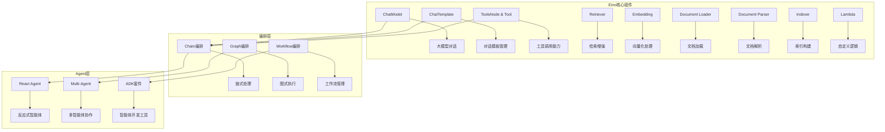
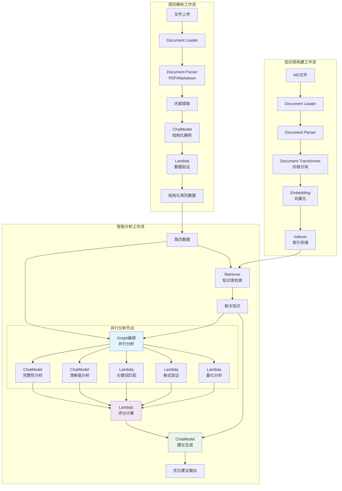

# Eino AI编排框架设计文档

## 1. 概述

Eino是字节跳动开源的大语言模型应用开发框架，基于Go语言构建。为简历优化系统提供了强大的AI工作流编排能力，支持Chain、Graph、Workflow等多种编排模式。

> 参考文档：[Eino官方文档](https://www.cloudwego.io/zh/docs/eino/quick_start/)

## 2. Eino核心架构

### 2.1 核心组件体系



### 2.2 简历优化系统架构图



## 3. 核心工作流设计

### 3.1 简历解析Chain

基于Eino的Chain编排，实现简历文档的智能解析。

```go
package main

import (
    "context"
    "fmt"
    
    "github.com/cloudwego/eino/chains"
    "github.com/cloudwego/eino/components/document"
    "github.com/cloudwego/eino/components/model"
    "github.com/cloudwego/eino/components/prompt"
    "github.com/cloudwego/eino/schema"
)

// ResumeParsingChain 简历解析链
type ResumeParsingChain struct {
    loader    document.Loader
    parser    document.Parser
    chatModel model.ChatModel
    template  prompt.ChatTemplate
}

// NewResumeParsingChain 创建简历解析链
func NewResumeParsingChain() *ResumeParsingChain {
    return &ResumeParsingChain{
        loader:    document.NewLocalFileLoader(),
        parser:    document.NewPDFParser(),
        chatModel: model.NewOpenAIChat(),
        template:  prompt.NewChatTemplate(),
    }
}

// Execute 执行简历解析
func (c *ResumeParsingChain) Execute(ctx context.Context, filePath string) (*schema.ResumeData, error) {
    // 1. 文档加载
    docs, err := c.loader.Load(ctx, filePath)
    if err != nil {
        return nil, fmt.Errorf("文档加载失败: %w", err)
    }
    
    // 2. 文档解析
    content, err := c.parser.Parse(ctx, docs[0])
    if err != nil {
        return nil, fmt.Errorf("文档解析失败: %w", err)
    }
    
    // 3. 结构化提取
    prompt := c.buildStructurePrompt(content)
    response, err := c.chatModel.Generate(ctx, prompt)
    if err != nil {
        return nil, fmt.Errorf("结构化提取失败: %w", err)
    }
    
    // 4. 解析响应为结构化数据
    resumeData, err := c.parseResumeData(response.Content)
    if err != nil {
        return nil, fmt.Errorf("数据解析失败: %w", err)
    }
    
    return resumeData, nil
}

// buildStructurePrompt 构建结构化提取提示
func (c *ResumeParsingChain) buildStructurePrompt(content string) []*schema.Message {
    systemPrompt := `你是一个专业的简历解析专家。请将以下简历内容解析为结构化的JSON格式。

请识别并提取以下章节：
1. 个人信息 (personal_info)：姓名、联系方式、邮箱等
2. 教育背景 (education)：学校、专业、学历、时间等  
3. 工作经历 (experience)：公司、职位、时间、工作内容等
4. 项目经历 (projects)：项目名称、角色、技术栈、成果等
5. 技能特长 (skills)：技术技能、语言能力等
6. 其他信息 (others)：获奖经历、证书等

请严格按照JSON格式输出，确保数据的准确性和完整性。`

    userPrompt := fmt.Sprintf("简历内容：\n%s", content)
    
    return []*schema.Message{
        {Role: schema.System, Content: systemPrompt},
        {Role: schema.Human, Content: userPrompt},
    }
}
```

### 3.2 智能分析Graph

使用Eino的Graph编排实现并行分析任务。

```go
package main

import (
    "context"
    "sync"
    
    "github.com/cloudwego/eino/compose"
    "github.com/cloudwego/eino/components/model"
    "github.com/cloudwego/eino/components/retriever"
    "github.com/cloudwego/eino/schema"
)

// AnalysisGraph 分析图
type AnalysisGraph struct {
    chatModel   model.ChatModel
    retriever   retriever.Retriever
    graph       *compose.Graph
}

// NewAnalysisGraph 创建分析图
func NewAnalysisGraph() *AnalysisGraph {
    g := &AnalysisGraph{
        chatModel: model.NewOpenAIChat(),
        retriever: retriever.NewMilvusRetriever(),
        graph:     compose.NewGraph(),
    }
    
    g.buildGraph()
    return g
}

// buildGraph 构建分析图
func (g *AnalysisGraph) buildGraph() {
    // 知识检索节点
    knowledgeNode := g.graph.AddNode("knowledge_retrieval", g.knowledgeRetrieval)
    
    // 并行分析节点
    completenessNode := g.graph.AddNode("completeness_analysis", g.completenessAnalysis)
    clarityNode := g.graph.AddNode("clarity_analysis", g.clarityAnalysis)
    keywordNode := g.graph.AddNode("keyword_analysis", g.keywordAnalysis)
    formatNode := g.graph.AddNode("format_analysis", g.formatAnalysis)
    quantNode := g.graph.AddNode("quantification_analysis", g.quantificationAnalysis)
    
    // 评分计算节点
    scoreNode := g.graph.AddNode("score_calculation", g.scoreCalculation)
    
    // 建议生成节点
    suggestionNode := g.graph.AddNode("suggestion_generation", g.suggestionGeneration)
    
    // 构建图边
    g.graph.AddEdge(knowledgeNode, completenessNode)
    g.graph.AddEdge(knowledgeNode, clarityNode)
    g.graph.AddEdge(knowledgeNode, keywordNode)
    g.graph.AddEdge(knowledgeNode, formatNode)
    g.graph.AddEdge(knowledgeNode, quantNode)
    
    g.graph.AddEdge(completenessNode, scoreNode)
    g.graph.AddEdge(clarityNode, scoreNode)
    g.graph.AddEdge(keywordNode, scoreNode)
    g.graph.AddEdge(formatNode, scoreNode)
    g.graph.AddEdge(quantNode, scoreNode)
    
    g.graph.AddEdge(scoreNode, suggestionNode)
    g.graph.AddEdge(knowledgeNode, suggestionNode)
}

// Execute 执行分析图
func (g *AnalysisGraph) Execute(ctx context.Context, resumeData *schema.ResumeData, targetPosition string) (*schema.AnalysisResult, error) {
    input := map[string]interface{}{
        "resume_data":     resumeData,
        "target_position": targetPosition,
    }
    
    result, err := g.graph.Invoke(ctx, input)
    if err != nil {
        return nil, fmt.Errorf("分析执行失败: %w", err)
    }
    
    return result.(*schema.AnalysisResult), nil
}

// knowledgeRetrieval 知识检索节点
func (g *AnalysisGraph) knowledgeRetrieval(ctx context.Context, input map[string]interface{}) (map[string]interface{}, error) {
    targetPosition := input["target_position"].(string)
    resumeData := input["resume_data"].(*schema.ResumeData)
    
    // 构建检索查询
    query := fmt.Sprintf("职位: %s, 技能: %v", targetPosition, resumeData.Skills.Technical)
    
    // 执行向量检索
    knowledge, err := g.retriever.Retrieve(ctx, query, &retriever.Options{
        TopK:               10,
        SimilarityThreshold: 0.7,
    })
    if err != nil {
        return nil, fmt.Errorf("知识检索失败: %w", err)
    }
    
    output := make(map[string]interface{})
    for k, v := range input {
        output[k] = v
    }
    output["knowledge"] = knowledge
    
    return output, nil
}

// completenessAnalysis 完整性分析节点
func (g *AnalysisGraph) completenessAnalysis(ctx context.Context, input map[string]interface{}) (map[string]interface{}, error) {
    resumeData := input["resume_data"].(*schema.ResumeData)
    knowledge := input["knowledge"].([]schema.Document)
    targetPosition := input["target_position"].(string)
    
    prompt := g.buildCompletenessPrompt(resumeData, knowledge, targetPosition)
    
    response, err := g.chatModel.Generate(ctx, prompt)
    if err != nil {
        return nil, fmt.Errorf("完整性分析失败: %w", err)
    }
    
    output := make(map[string]interface{})
    for k, v := range input {
        output[k] = v
    }
    output["completeness_result"] = response.Content
    
    return output, nil
}

// clarityAnalysis 清晰度分析节点
func (g *AnalysisGraph) clarityAnalysis(ctx context.Context, input map[string]interface{}) (map[string]interface{}, error) {
    resumeData := input["resume_data"].(*schema.ResumeData)
    
    prompt := g.buildClarityPrompt(resumeData)
    
    response, err := g.chatModel.Generate(ctx, prompt)
    if err != nil {
        return nil, fmt.Errorf("清晰度分析失败: %w", err)
    }
    
    output := make(map[string]interface{})
    for k, v := range input {
        output[k] = v
    }
    output["clarity_result"] = response.Content
    
    return output, nil
}

// keywordAnalysis 关键词分析节点  
func (g *AnalysisGraph) keywordAnalysis(ctx context.Context, input map[string]interface{}) (map[string]interface{}, error) {
    resumeData := input["resume_data"].(*schema.ResumeData)
    targetPosition := input["target_position"].(string)
    
    // 实现关键词匹配算法
    score := g.calculateKeywordMatch(resumeData, targetPosition)
    
    output := make(map[string]interface{})
    for k, v := range input {
        output[k] = v
    }
    output["keyword_result"] = score
    
    return output, nil
}

// formatAnalysis 格式分析节点
func (g *AnalysisGraph) formatAnalysis(ctx context.Context, input map[string]interface{}) (map[string]interface{}, error) {
    resumeData := input["resume_data"].(*schema.ResumeData)
    
    // 实现格式验证逻辑
    score := g.validateFormat(resumeData)
    
    output := make(map[string]interface{})
    for k, v := range input {
        output[k] = v
    }
    output["format_result"] = score
    
    return output, nil
}

// quantificationAnalysis 量化分析节点
func (g *AnalysisGraph) quantificationAnalysis(ctx context.Context, input map[string]interface{}) (map[string]interface{}, error) {
    resumeData := input["resume_data"].(*schema.ResumeData)
    
    // 实现量化程度分析
    score := g.analyzeQuantification(resumeData)
    
    output := make(map[string]interface{})
    for k, v := range input {
        output[k] = v
    }
    output["quantification_result"] = score
    
    return output, nil
}

// scoreCalculation 评分计算节点
func (g *AnalysisGraph) scoreCalculation(ctx context.Context, input map[string]interface{}) (map[string]interface{}, error) {
    // 提取各维度评分
    completeness := g.parseScore(input["completeness_result"].(string))
    clarity := g.parseScore(input["clarity_result"].(string))
    keyword := input["keyword_result"].(float64)
    format := input["format_result"].(float64)
    quantification := input["quantification_result"].(float64)
    
    // 加权计算总分
    weights := map[string]float64{
        "completeness":    0.25,
        "clarity":         0.20, 
        "keyword":         0.20,
        "format":          0.15,
        "quantification":  0.20,
    }
    
    finalScore := completeness*weights["completeness"] +
        clarity*weights["clarity"] +
        keyword*weights["keyword"] +
        format*weights["format"] +
        quantification*weights["quantification"]
    
    output := make(map[string]interface{})
    for k, v := range input {
        output[k] = v
    }
    output["final_score"] = finalScore
    output["dimension_scores"] = map[string]float64{
        "completeness":    completeness,
        "clarity":         clarity,
        "keyword":         keyword,
        "format":          format,
        "quantification":  quantification,
    }
    
    return output, nil
}

// suggestionGeneration 建议生成节点
func (g *AnalysisGraph) suggestionGeneration(ctx context.Context, input map[string]interface{}) (map[string]interface{}, error) {
    finalScore := input["final_score"].(float64)
    dimensionScores := input["dimension_scores"].(map[string]float64)
    knowledge := input["knowledge"].([]schema.Document)
    
    prompt := g.buildSuggestionPrompt(finalScore, dimensionScores, knowledge)
    
    response, err := g.chatModel.Generate(ctx, prompt)
    if err != nil {
        return nil, fmt.Errorf("建议生成失败: %w", err)
    }
    
    output := make(map[string]interface{})
    for k, v := range input {
        output[k] = v
    }
    output["suggestions"] = response.Content
    
    return output, nil
}
```

### 3.3 React Agent应用

使用Eino的React Agent实现智能问答。

```go
package main

import (
    "context"
    
    "github.com/cloudwego/eino/components/agent"
    "github.com/cloudwego/eino/components/model"
    "github.com/cloudwego/eino/components/tool"
    "github.com/cloudwego/eino/schema"
)

// ResumeOptimizeAgent 简历优化智能体
type ResumeOptimizeAgent struct {
    agent agent.ReactAgent
}

// NewResumeOptimizeAgent 创建简历优化智能体
func NewResumeOptimizeAgent() *ResumeOptimizeAgent {
    // 创建ChatModel
    chatModel := model.NewOpenAIChat()
    
    // 创建工具集
    tools := []tool.Tool{
        tool.NewResumeAnalysisTool(),
        tool.NewJobMatchingTool(), 
        tool.NewTemplateRecommendTool(),
        tool.NewMarketResearchTool(),
    }
    
    // 创建React Agent
    reactAgent := agent.NewReactAgent(
        agent.WithChatModel(chatModel),
        agent.WithTools(tools),
        agent.WithSystemMessage("你是一个专业的简历优化专家，能够帮助用户分析简历、提供优化建议、推荐模板等。"),
    )
    
    return &ResumeOptimizeAgent{
        agent: reactAgent,
    }
}

// Chat 与智能体对话
func (a *ResumeOptimizeAgent) Chat(ctx context.Context, message string) (string, error) {
    response, err := a.agent.Invoke(ctx, &schema.AgentInput{
        Message: message,
    })
    if err != nil {
        return "", fmt.Errorf("智能体调用失败: %w", err)
    }
    
    return response.Message, nil
}

// 自定义工具实现
type ResumeAnalysisTool struct{}

func NewResumeAnalysisTool() tool.Tool {
    return &ResumeAnalysisTool{}
}

func (t *ResumeAnalysisTool) Name() string {
    return "resume_analysis"
}

func (t *ResumeAnalysisTool) Description() string {
    return "分析简历内容，给出详细的评分和建议"
}

func (t *ResumeAnalysisTool) Parameters() map[string]interface{} {
    return map[string]interface{}{
        "type": "object",
        "properties": map[string]interface{}{
            "resume_text": map[string]interface{}{
                "type":        "string",
                "description": "简历文本内容",
            },
            "target_position": map[string]interface{}{
                "type":        "string", 
                "description": "目标职位",
            },
        },
        "required": []string{"resume_text"},
    }
}

func (t *ResumeAnalysisTool) Invoke(ctx context.Context, params map[string]interface{}) (interface{}, error) {
    resumeText := params["resume_text"].(string)
    targetPosition, _ := params["target_position"].(string)
    
    // 调用简历分析服务
    analysisResult, err := analyzeResume(ctx, resumeText, targetPosition)
    if err != nil {
        return nil, err
    }
    
    return analysisResult, nil
}
```

## 4. Workflow编排框架

### 4.1 简历优化Workflow

```go
package main

import (
    "context"
    "time"
    
    "github.com/cloudwego/eino/compose/workflow"
    "github.com/cloudwego/eino/schema"
)

// ResumeOptimizationWorkflow 简历优化工作流
type ResumeOptimizationWorkflow struct {
    workflow *workflow.Workflow
}

// NewResumeOptimizationWorkflow 创建简历优化工作流
func NewResumeOptimizationWorkflow() *ResumeOptimizationWorkflow {
    wf := workflow.NewWorkflow()
    
    // 定义工作流步骤
    wf.AddStep("file_upload", &FileUploadStep{})
    wf.AddStep("document_parsing", &DocumentParsingStep{})
    wf.AddStep("structure_extraction", &StructureExtractionStep{})
    wf.AddStep("knowledge_retrieval", &KnowledgeRetrievalStep{})
    wf.AddStep("parallel_analysis", &ParallelAnalysisStep{})
    wf.AddStep("score_calculation", &ScoreCalculationStep{})
    wf.AddStep("suggestion_generation", &SuggestionGenerationStep{})
    wf.AddStep("report_generation", &ReportGenerationStep{})
    
    // 定义工作流连接
    wf.Connect("file_upload", "document_parsing")
    wf.Connect("document_parsing", "structure_extraction")
    wf.Connect("structure_extraction", "knowledge_retrieval")
    wf.Connect("knowledge_retrieval", "parallel_analysis")
    wf.Connect("parallel_analysis", "score_calculation")
    wf.Connect("score_calculation", "suggestion_generation")
    wf.Connect("suggestion_generation", "report_generation")
    
    return &ResumeOptimizationWorkflow{
        workflow: wf,
    }
}

// Execute 执行工作流
func (w *ResumeOptimizationWorkflow) Execute(ctx context.Context, input *schema.WorkflowInput) (*schema.WorkflowOutput, error) {
    // 设置超时
    ctx, cancel := context.WithTimeout(ctx, 5*time.Minute)
    defer cancel()
    
    // 执行工作流
    result, err := w.workflow.Run(ctx, input)
    if err != nil {
        return nil, fmt.Errorf("工作流执行失败: %w", err)
    }
    
    return result, nil
}

// 工作流步骤实现
type FileUploadStep struct{}

func (s *FileUploadStep) Execute(ctx context.Context, input map[string]interface{}) (map[string]interface{}, error) {
    // 文件上传逻辑
    filePath := input["file_path"].(string)
    
    // 验证文件格式和大小
    if err := validateFile(filePath); err != nil {
        return nil, fmt.Errorf("文件验证失败: %w", err)
    }
    
    return map[string]interface{}{
        "validated_file_path": filePath,
        "file_type":          detectFileType(filePath),
    }, nil
}

type DocumentParsingStep struct{}

func (s *DocumentParsingStep) Execute(ctx context.Context, input map[string]interface{}) (map[string]interface{}, error) {
    filePath := input["validated_file_path"].(string)
    fileType := input["file_type"].(string)
    
    var content string
    var err error
    
    switch fileType {
    case "pdf":
        content, err = parsePDF(filePath)
    case "markdown":
        content, err = parseMarkdown(filePath)
    default:
        return nil, fmt.Errorf("不支持的文件类型: %s", fileType)
    }
    
    if err != nil {
        return nil, fmt.Errorf("文档解析失败: %w", err)
    }
    
    return map[string]interface{}{
        "raw_content": content,
        "file_type":   fileType,
    }, nil
}

type StructureExtractionStep struct{}

func (s *StructureExtractionStep) Execute(ctx context.Context, input map[string]interface{}) (map[string]interface{}, error) {
    content := input["raw_content"].(string)
    
    // 使用ChatModel进行结构化提取
    structuredData, err := extractStructure(ctx, content)
    if err != nil {
        return nil, fmt.Errorf("结构提取失败: %w", err)
    }
    
    return map[string]interface{}{
        "structured_data": structuredData,
    }, nil
}
```

## 5. Eino开发工具链集成

### 5.1 可视化编排

Eino提供了强大的可视化编排插件，支持：

- **可视化工作流设计**：通过拖拽方式构建复杂的AI工作流
- **实时调试能力**：支持断点调试、变量查看、执行监控
- **组件库管理**：丰富的预置组件和自定义组件支持

### 5.2 监控与回调

```go
package main

import (
    "context"
    
    "github.com/cloudwego/eino/callbacks"
    "github.com/cloudwego/eino/callbacks/langfuse"
    "github.com/cloudwego/eino/callbacks/apmplus"
)

// CallbackManager 回调管理器
type CallbackManager struct {
    langfuse *langfuse.Callback
    apmplus  *apmplus.Callback
}

// NewCallbackManager 创建回调管理器
func NewCallbackManager() *CallbackManager {
    return &CallbackManager{
        langfuse: langfuse.New(&langfuse.Config{
            PublicKey:  "your-public-key",
            SecretKey:  "your-secret-key",
            Host:       "https://cloud.langfuse.com",
        }),
        apmplus: apmplus.New(&apmplus.Config{
            ServiceName: "resume-optimization",
            Environment: "production",
        }),
    }
}

// RegisterCallbacks 注册回调
func (m *CallbackManager) RegisterCallbacks(component interface{}) {
    if c, ok := component.(callbacks.CallbacksSupported); ok {
        c.RegisterCallback(m.langfuse)
        c.RegisterCallback(m.apmplus)
    }
}

// 使用示例
func main() {
    callbackManager := NewCallbackManager()
    
    // 创建ChatModel并注册回调
    chatModel := model.NewOpenAIChat()
    callbackManager.RegisterCallbacks(chatModel)
    
    // 创建工作流并注册回调
    workflow := NewResumeOptimizationWorkflow()
    callbackManager.RegisterCallbacks(workflow)
}
```

## 6. 性能优化与扩展

### 6.1 并发优化

```go
package main

import (
    "context"
    "sync"
    
    "golang.org/x/sync/semaphore"
)

// ConcurrentAnalyzer 并发分析器
type ConcurrentAnalyzer struct {
    semaphore *semaphore.Weighted
    maxWorkers int64
}

// NewConcurrentAnalyzer 创建并发分析器
func NewConcurrentAnalyzer(maxWorkers int64) *ConcurrentAnalyzer {
    return &ConcurrentAnalyzer{
        semaphore:  semaphore.NewWeighted(maxWorkers),
        maxWorkers: maxWorkers,
    }
}

// AnalyzeBatch 批量分析
func (a *ConcurrentAnalyzer) AnalyzeBatch(ctx context.Context, resumes []*schema.ResumeData) ([]*schema.AnalysisResult, error) {
    results := make([]*schema.AnalysisResult, len(resumes))
    var wg sync.WaitGroup
    var mu sync.Mutex
    errors := make([]error, 0)
    
    for i, resume := range resumes {
        wg.Add(1)
        go func(index int, r *schema.ResumeData) {
            defer wg.Done()
            
            // 获取信号量
            if err := a.semaphore.Acquire(ctx, 1); err != nil {
                mu.Lock()
                errors = append(errors, err)
                mu.Unlock()
                return
            }
            defer a.semaphore.Release(1)
            
            // 执行分析
            result, err := analyzeResume(ctx, r)
            if err != nil {
                mu.Lock()
                errors = append(errors, err)
                mu.Unlock()
                return
            }
            
            mu.Lock()
            results[index] = result
            mu.Unlock()
        }(i, resume)
    }
    
    wg.Wait()
    
    if len(errors) > 0 {
        return nil, fmt.Errorf("批量分析存在错误: %v", errors)
    }
    
    return results, nil
}
```

### 6.2 缓存机制

```go
package main

import (
    "context"
    "crypto/md5"
    "encoding/hex"
    "time"
    
    "github.com/go-redis/redis/v8"
)

// CacheManager 缓存管理器
type CacheManager struct {
    client *redis.Client
    ttl    time.Duration
}

// NewCacheManager 创建缓存管理器
func NewCacheManager(redisAddr string, ttl time.Duration) *CacheManager {
    rdb := redis.NewClient(&redis.Options{
        Addr: redisAddr,
    })
    
    return &CacheManager{
        client: rdb,
        ttl:    ttl,
    }
}

// Get 获取缓存
func (c *CacheManager) Get(ctx context.Context, key string) (string, error) {
    return c.client.Get(ctx, key).Result()
}

// Set 设置缓存
func (c *CacheManager) Set(ctx context.Context, key, value string) error {
    return c.client.Set(ctx, key, value, c.ttl).Err()
}

// GetOrSet 获取或设置缓存
func (c *CacheManager) GetOrSet(ctx context.Context, key string, fn func() (string, error)) (string, error) {
    // 尝试从缓存获取
    if value, err := c.Get(ctx, key); err == nil {
        return value, nil
    }
    
    // 缓存未命中，执行函数
    value, err := fn()
    if err != nil {
        return "", err
    }
    
    // 设置缓存
    if err := c.Set(ctx, key, value); err != nil {
        // 缓存设置失败不影响业务逻辑
        fmt.Printf("缓存设置失败: %v\n", err)
    }
    
    return value, nil
}

// GenerateKey 生成缓存键
func (c *CacheManager) GenerateKey(prefix string, data ...string) string {
    h := md5.New()
    for _, d := range data {
        h.Write([]byte(d))
    }
    hash := hex.EncodeToString(h.Sum(nil))
    return fmt.Sprintf("%s:%s", prefix, hash)
}

// 使用示例
func analyzeResumeWithCache(ctx context.Context, resumeData *schema.ResumeData, cacheManager *CacheManager) (*schema.AnalysisResult, error) {
    // 生成缓存键
    cacheKey := cacheManager.GenerateKey("analysis", resumeData.ID, resumeData.Version)
    
    // 从缓存获取或执行分析
    resultJSON, err := cacheManager.GetOrSet(ctx, cacheKey, func() (string, error) {
        result, err := performAnalysis(ctx, resumeData)
        if err != nil {
            return "", err
        }
        
        jsonData, err := json.Marshal(result)
        if err != nil {
            return "", err
        }
        
        return string(jsonData), nil
    })
    
    if err != nil {
        return nil, err
    }
    
    // 反序列化结果
    var result schema.AnalysisResult
    if err := json.Unmarshal([]byte(resultJSON), &result); err != nil {
        return nil, err
    }
    
    return &result, nil
}
```

## 7. 部署与运维

### 7.1 Docker部署

```dockerfile
# Dockerfile
FROM golang:1.19-alpine AS builder

WORKDIR /app
COPY go.mod go.sum ./
RUN go mod download

COPY . .
RUN CGO_ENABLED=0 GOOS=linux go build -o resume-optimizer ./cmd/main.go

FROM alpine:latest
RUN apk --no-cache add ca-certificates
WORKDIR /root/

COPY --from=builder /app/resume-optimizer .
COPY --from=builder /app/configs ./configs

EXPOSE 8080
CMD ["./resume-optimizer"]
```

```yaml
# docker-compose.yml
version: '3.8'
services:
  resume-optimizer:
    build: .
    ports:
      - "8080:8080"
    environment:
      - EINO_MODEL_PROVIDER=openai
      - EINO_OPENAI_API_KEY=${OPENAI_API_KEY}
      - REDIS_ADDR=redis:6379
      - MILVUS_ADDR=milvus:19530
    depends_on:
      - redis
      - milvus
    volumes:
      - ./configs:/app/configs
      - ./data:/app/data

  redis:
    image: redis:7-alpine
    ports:
      - "6379:6379"
    volumes:
      - redis_data:/data

  milvus:
    image: milvusdb/milvus:v2.3.0
    ports:
      - "19530:19530"
    environment:
      - ETCD_ENDPOINTS=etcd:2379
      - MINIO_ADDRESS=minio:9000
    depends_on:
      - etcd
      - minio
    volumes:
      - milvus_data:/var/lib/milvus

  etcd:
    image: quay.io/coreos/etcd:v3.5.0
    environment:
      - ETCD_AUTO_COMPACTION_MODE=revision
      - ETCD_AUTO_COMPACTION_RETENTION=1000
      - ETCD_QUOTA_BACKEND_BYTES=4294967296
    volumes:
      - etcd_data:/etcd

  minio:
    image: minio/minio:RELEASE.2023-03-20T20-16-18Z
    environment:
      - MINIO_ACCESS_KEY=minioadmin
      - MINIO_SECRET_KEY=minioadmin
    ports:
      - "9000:9000"
      - "9001:9001"
    volumes:
      - minio_data:/data
    command: minio server /data --console-address ":9001"

volumes:
  redis_data:
  milvus_data:
  etcd_data:
  minio_data:
```

### 7.2 Kubernetes部署

```yaml
# k8s-deployment.yaml
apiVersion: apps/v1
kind: Deployment
metadata:
  name: resume-optimizer
  namespace: ai-apps
spec:
  replicas: 3
  selector:
    matchLabels:
      app: resume-optimizer
  template:
    metadata:
      labels:
        app: resume-optimizer
    spec:
      containers:
      - name: resume-optimizer
        image: resume-optimizer:v1.0
        ports:
        - containerPort: 8080
        env:
        - name: EINO_MODEL_PROVIDER
          value: "openai"
        - name: EINO_OPENAI_API_KEY
          valueFrom:
            secretKeyRef:
              name: openai-secret
              key: api-key
        - name: REDIS_ADDR
          value: "redis-service:6379"
        - name: MILVUS_ADDR
          value: "milvus-service:19530"
        resources:
          requests:
            memory: "512Mi"
            cpu: "500m"
          limits:
            memory: "1Gi"
            cpu: "1000m"
        livenessProbe:
          httpGet:
            path: /health
            port: 8080
          initialDelaySeconds: 30
          periodSeconds: 10
        readinessProbe:
          httpGet:
            path: /ready
            port: 8080
          initialDelaySeconds: 5
          periodSeconds: 5

---
apiVersion: v1
kind: Service
metadata:
  name: resume-optimizer-service
  namespace: ai-apps
spec:
  selector:
    app: resume-optimizer
  ports:
  - protocol: TCP
    port: 80
    targetPort: 8080
  type: LoadBalancer
```

## 8. 最佳实践

### 8.1 错误处理

```go
package main

import (
    "context"
    "errors"
    "fmt"
    "time"
    
    "github.com/cloudwego/eino/schema"
)

// ErrorHandler 错误处理器
type ErrorHandler struct {
    maxRetries int
    backoff    time.Duration
}

// NewErrorHandler 创建错误处理器
func NewErrorHandler(maxRetries int, backoff time.Duration) *ErrorHandler {
    return &ErrorHandler{
        maxRetries: maxRetries,
        backoff:    backoff,
    }
}

// RetryWithBackoff 带退避的重试
func (h *ErrorHandler) RetryWithBackoff(ctx context.Context, fn func() error) error {
    var lastErr error
    
    for i := 0; i <= h.maxRetries; i++ {
        if err := fn(); err == nil {
            return nil
        } else {
            lastErr = err
            
            // 判断是否为可重试错误
            if !h.isRetryableError(err) {
                return err
            }
            
            // 最后一次重试失败
            if i == h.maxRetries {
                break
            }
            
            // 指数退避
            backoffDuration := h.backoff * time.Duration(1<<uint(i))
            
            select {
            case <-time.After(backoffDuration):
                continue
            case <-ctx.Done():
                return ctx.Err()
            }
        }
    }
    
    return fmt.Errorf("重试%d次后仍然失败: %w", h.maxRetries, lastErr)
}

// isRetryableError 判断是否为可重试错误
func (h *ErrorHandler) isRetryableError(err error) bool {
    // 网络超时错误
    if errors.Is(err, context.DeadlineExceeded) {
        return true
    }
    
    // 临时网络错误
    if netErr, ok := err.(interface{ Temporary() bool }); ok && netErr.Temporary() {
        return true
    }
    
    // API限流错误
    if isRateLimitError(err) {
        return true
    }
    
    // 服务器内部错误
    if isServerError(err) {
        return true
    }
    
    return false
}
```

### 8.2 链路追踪

```go
package main

import (
    "context"
    
    "go.opentelemetry.io/otel"
    "go.opentelemetry.io/otel/trace"
)

// TracingManager 链路追踪管理器
type TracingManager struct {
    tracer trace.Tracer
}

// NewTracingManager 创建链路追踪管理器
func NewTracingManager(serviceName string) *TracingManager {
    tracer := otel.Tracer(serviceName)
    return &TracingManager{tracer: tracer}
}

// TraceWorkflow 追踪工作流执行
func (t *TracingManager) TraceWorkflow(ctx context.Context, workflowName string, fn func(context.Context) error) error {
    ctx, span := t.tracer.Start(ctx, fmt.Sprintf("workflow.%s", workflowName))
    defer span.End()
    
    // 添加工作流属性
    span.SetAttributes(
        attribute.String("workflow.name", workflowName),
        attribute.String("workflow.version", "1.0"),
    )
    
    if err := fn(ctx); err != nil {
        span.RecordError(err)
        span.SetStatus(codes.Error, err.Error())
        return err
    }
    
    span.SetStatus(codes.Ok, "success")
    return nil
}

// TraceStep 追踪步骤执行
func (t *TracingManager) TraceStep(ctx context.Context, stepName string, fn func(context.Context) error) error {
    ctx, span := t.tracer.Start(ctx, fmt.Sprintf("step.%s", stepName))
    defer span.End()
    
    span.SetAttributes(
        attribute.String("step.name", stepName),
    )
    
    start := time.Now()
    err := fn(ctx)
    duration := time.Since(start)
    
    span.SetAttributes(
        attribute.Int64("step.duration_ms", duration.Milliseconds()),
    )
    
    if err != nil {
        span.RecordError(err)
        span.SetStatus(codes.Error, err.Error())
        return err
    }
    
    span.SetStatus(codes.Ok, "success")
    return nil
}
```

## 9. 总结

基于Eino Go框架的简历优化系统具备以下核心优势：

### 9.1 技术优势
- **原生Go性能**：高并发、低延迟的处理能力
- **模块化设计**：组件化架构，易于扩展和维护
- **多样化编排**：支持Chain、Graph、Workflow多种编排方式
- **生态完整**：丰富的组件集成和工具链支持

### 9.2 业务价值
- **智能化分析**：基于大模型的深度语义理解
- **个性化建议**：结合知识库的精准优化建议
- **高效处理**：并行化处理提升用户体验
- **可扩展性**：支持多场景、多维度的业务扩展

### 9.3 运维保障
- **可观测性**：完整的监控、日志、追踪体系
- **容错机制**：多层次的错误处理和降级策略
- **部署简单**：容器化部署，支持云原生架构

通过Eino框架的强大能力，我们能够构建一个真正智能化、工业级的简历优化系统，为用户提供卓越的简历优化体验。

---

*参考文档：[Eino官方文档](https://www.cloudwego.io/zh/docs/eino/quick_start/)*  
*本文档版本：v2.0*  
*创建日期：2024-01-01*  
*最后更新：2024-01-01*
