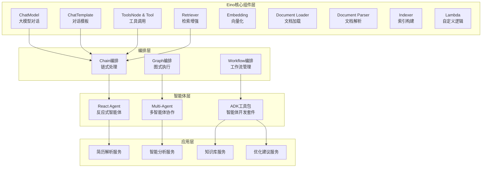

# 简历优化系统文档目录

## 📚 文档概览

本目录包含基于字节跳动开源Eino框架的智能简历优化系统完整设计文档，为开发团队提供详细的产品需求、技术架构和实施指南。

> **Eino框架**：字节跳动开源的大语言模型应用开发框架，基于Go语言构建
> 参考文档：[Eino官方文档](https://www.cloudwego.io/zh/docs/eino/quick_start/)

## 📋 文档列表

### 1. 项目导航文档
**文件名**: `README.md`

**内容概述**: 项目概览、技术栈介绍、文档导航、快速开始指南

**适用人群**: 所有项目参与者

### 2. 产品需求文档 (PRD)
**文件名**: `PRD_简历优化系统.md`

**内容概述**:
- 产品定位与市场分析
- 功能需求详细设计
- 技术架构与选型
- 微服务设计方案
- 数据库设计
- API接口设计
- 性能与安全要求
- 项目规划与风险评估

**适用人群**: 产品经理、项目经理、开发团队、测试团队

### 3. Eino AI编排设计文档
**文件名**: `Eino编排设计文档.md`

**内容概述**:
- Eino Go框架核心架构
- 三大核心工作流设计
  - Chain编排：简历解析链
  - Graph编排：智能分析图
  - Workflow编排：完整业务流程
- React Agent智能体应用
- 组件集成与工具链
- 性能优化与扩展
- 部署与运维指南

**适用人群**: AI工程师、Go后端工程师、运维工程师

### 4. 技术架构设计文档
**文件名**: `技术架构设计.md`

**内容概述**:
- 分层架构详解
- 微服务拆分策略
- 前端架构设计
- 数据流设计
- 缓存策略
- 安全机制
- 性能优化方案

**适用人群**: 架构师、后端工程师、运维工程师

### 5. API设计文档
**文件名**: `API设计文档.md`

**内容概述**:
- RESTful API设计规范
- 认证授权机制
- 接口定义与示例
- 错误码设计
- 请求响应格式
- API版本管理
- 限流与监控

**适用人群**: 前端工程师、后端工程师、测试工程师、第三方集成开发者

## 🎯 核心特性

### 🤖 基于Eino的AI能力

- **Chain编排**：链式处理简历解析流程
- **Graph编排**：并行化智能分析任务
- **React Agent**：智能问答和建议生成
- **组件化设计**：ChatModel、ToolsNode、Retriever等

### 🏗️ 现代化技术架构

- **Go语言**：高性能、高并发的原生支持
- **Kratos微服务**：可扩展的服务架构
- **云原生部署**：Docker + Kubernetes
- **完善监控**：Prometheus + Grafana + Jaeger

### 📊 智能分析引擎

- **5维度评估**：完整性、清晰度、关键词、格式、量化
- **知识库增强**：向量化存储的行业知识
- **个性化建议**：基于岗位的精准优化
- **实时处理**：并行分析提升效率

### 🛠️ 开发工具链

- **可视化编排**：Eino Dev可视化工作流设计
- **实时调试**：断点调试、变量查看
- **链路追踪**：OpenTelemetry + Jaeger
- **监控回调**：Langfuse + APMPlus

## 🚀 技术栈总览

### 前端技术栈

- **框架**: Vue.js 3.x + Composition API
- **UI组件**: Element Plus
- **状态管理**: Pinia
- **构建工具**: Vite
- **类型检查**: TypeScript

### 后端技术栈

- **AI框架**: Eino (字节跳动开源Go框架)
- **微服务框架**: Kratos v2.x (Go)
- **服务发现**: Consul / etcd
- **消息队列**: Apache Kafka
- **缓存**: Redis Cluster
- **数据库**: MySQL 8.0+
- **搜索引擎**: ElasticSearch 8.x
- **对象存储**: MinIO

### AI技术栈

- **编排框架**: Eino (Go原生)
- **大语言模型**: OpenAI GPT-4 / Claude / 文心一言
- **向量数据库**: Milvus / Weaviate
- **文档解析**: unidoc (Go PDF库) + goldmark (Go Markdown库)
- **嵌入模型**: OpenAI Embedding / 百度文心

## 📊 Eino核心架构图



## 🔄 工作流设计

### 1. 简历解析Chain

```go
文件上传 → Document Loader → Document Parser → 
ChatModel结构化 → Lambda验证 → 结构化数据输出
```

### 2. 智能分析Graph

```go
                    → 完整性分析 →
知识库检索 → 并行分析 → 清晰度分析 → 评分计算 → 建议生成
                    → 关键词分析 →
                    → 格式分析 →
                    → 量化分析 →
```

### 3. React Agent应用

```go
用户输入 → Agent理解 → Tool调用 → 结果整合 → 智能回复
```

## 📈 性能指标

### 响应时间要求

- **文件上传**: ≤ 3秒 (基于Go原生性能)
- **简历解析**: ≤ 20秒 (Eino Chain优化)
- **智能分析**: ≤ 45秒 (Graph并行处理)
- **知识库搜索**: ≤ 1秒 (向量化检索)

### 并发处理能力

- **同时在线用户**: ≥ 2,000人 (Go高并发优势)
- **并发文件上传**: ≥ 200个/分钟
- **并发分析请求**: ≥ 100个/分钟
- **Agent对话**: ≥ 500个/分钟

### 可用性要求

- **系统可用性**: ≥ 99.9%
- **数据一致性**: 强一致性
- **灾备恢复**: RTO ≤ 30分钟

## 🔒 安全特性

### 数据安全

- **传输加密**: TLS 1.3
- **存储加密**: AES-256
- **敏感信息脱敏**: 自动化处理
- **数据备份**: 实时备份策略

### 访问控制

- **身份认证**: JWT Token + OAuth2
- **权限控制**: RBAC细粒度权限
- **API限流**: 基于令牌桶算法
- **防护机制**: 防SQL注入、XSS攻击

### AI安全

- **Prompt注入防护**: 输入过滤和验证
- **内容审核**: 敏感信息检测
- **模型访问控制**: API密钥管理
- **审计日志**: 完整的操作记录

## 📅 开发计划

### 阶段一: 核心框架搭建 (4周)

- [X]  Eino框架集成
- [X]  基础组件开发
- [X]  Chain编排实现
- [X]  核心API设计

### 阶段二: 智能分析引擎 (6周)

- [ ]  Graph并行分析
- [ ]  React Agent开发
- [ ]  知识库构建
- [ ]  评分算法优化

### 阶段三: 系统集成优化 (4周)

- [ ]  微服务集成
- [ ]  性能调优
- [ ]  监控告警
- [ ]  压力测试

### 阶段四: 生产部署 (2周)

- [ ]  容器化部署
- [ ]  CI/CD流水线
- [ ]  运维监控
- [ ]  文档完善

## 🛠️ Eino组件集成

### ChatModel集成

- **OpenAI**: GPT-4, GPT-3.5-turbo
- **Claude**: Claude-3-opus, Claude-3-sonnet
- **国产模型**: 文心一言、通义千问、深度求索

### Tool集成

- **Web搜索**: Google Search, Bing Search
- **文档处理**: PDF解析、Markdown处理
- **数据分析**: 统计计算、图表生成
- **API调用**: HTTP请求、数据库查询

### Retriever集成

- **向量检索**: Milvus, Weaviate
- **搜索引擎**: ElasticSearch
- **知识库**: Redis, 火山引擎VikingDB

### 监控回调

- **Langfuse**: AI应用性能监控
- **APMPlus**: 应用性能管理
- **自定义回调**: 业务指标监控

## 🎨 可视化工具

### Eino Dev插件

- **可视化编排**: 拖拽式工作流设计
- **实时调试**: 断点调试、变量查看
- **性能分析**: 执行时间、资源使用
- **组件库**: 丰富的预置组件

### 监控大屏

- **实时指标**: 处理量、成功率、响应时间
- **业务监控**: 用户活跃度、满意度评分
- **系统监控**: CPU、内存、网络使用率
- **告警管理**: 阈值设置、通知机制

## 🔧 部署架构

### 本地开发

```bash
# 启动Eino开发环境
go run cmd/main.go

# 可视化编排工具
eino dev --ui
```

### Docker部署

```yaml
services:
  resume-optimizer:
    image: resume-optimizer:latest
    environment:
      - EINO_MODEL_PROVIDER=openai
      - EINO_OPENAI_API_KEY=${API_KEY}
    ports:
      - "8080:8080"
```

### Kubernetes部署

```yaml
apiVersion: apps/v1
kind: Deployment
metadata:
  name: resume-optimizer
spec:
  replicas: 3
  template:
    spec:
      containers:
      - name: app
        image: resume-optimizer:v1.0
        resources:
          requests:
            memory: "1Gi"
            cpu: "500m"
```

## 📚 学习资源

### Eino官方资源

- [Eino快速开始](https://www.cloudwego.io/zh/docs/eino/quick_start/)
- [Eino核心模块](https://www.cloudwego.io/zh/docs/eino/core_modules/)
- [Eino组件集成](https://www.cloudwego.io/zh/docs/eino/integrations/)
- [Eino ADK开发套件](https://www.cloudwego.io/zh/docs/eino/adk/)

### 相关框架

- [Kratos微服务框架](https://go-kratos.dev/)
- [CloudWeGo生态](https://www.cloudwego.io/)
- [Go语言官方文档](https://golang.org/doc/)

## 📞 联系方式

如有疑问或建议，请联系开发团队：

- **项目地址**: [GitHub仓库](https://github.com/your-org/resume-optimizer)
- **技术交流**: [开发者群组](mailto:dev-team@company.com)
- **问题反馈**: [Issue提交](https://github.com/your-org/resume-optimizer/issues)

## ⭐ 贡献指南

欢迎为项目贡献代码！

1. Fork项目仓库
2. 创建特性分支 (`git checkout -b feature/amazing-feature`)
3. 提交更改 (`git commit -m 'Add amazing feature'`)
4. 推送到分支 (`git push origin feature/amazing-feature`)
5. 创建Pull Request

## 📄 许可证

本项目采用 MIT 许可证。详见 [LICENSE](../LICENSE) 文件。

---

**文档维护**: liyubo06
**最后更新**: 2025
**版本**: v2.0
**基于框架**: [Eino v1.0](https://www.cloudwego.io/zh/docs/eino/)
